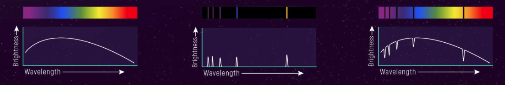

## Course repository for the ***Intro to Spectroscopy 2025*** Workshop 
taught for BRIEF Boyce Astro Foundation by Chandru Narayan

## Course Outline

### BAROSpection - Introduction to Spectroscopy

### Introduction to Light & Matter and Electromagnetism
1. What is Light?
1. Electromagnetic Waves
1. Photons & Matter

### Light & Matter Interactions
1.  What is a Blackbody 
1.  Electromagnetic Spectrum
1.  Modeling a Black Body
1.  Waves & Particles

### Spectroscopy
1. What is Spectroscopy
1. Types of Spectra
    1. Continuous Spectrum
    1. Absorption Spectrum
    1. Emission Spectrum
1. Source of Spectral Lines
1. Calculating Balmer's Constant
1. Doppler Effect on Spectral Lines

### Star Properties
1. Star Types
1. What can you learn from Star Spectra
2. HertzSprung Russell Diagram (HRD)
3. Plot an HRD for Sun's 100 Parsec neighbourhood

### Obtain Spectra from the BARO Telescope
1. Spectral Grating configuration on BARO
1. Selecting Targets in the Solar Neiborhood
1. Create Target List for Hot & Cool Stars & Nebulae
1. Schedule to obtain Spectra
1. Calibrate using RSpec 

### Analyze & Publish Sprectral Images
1. Use RSpec to Analyze Spectral Lines
1. Measure Wavelenghts & Frequencies
1. Measure Shift in Spectral Lines
1. Compare against NIST Standard
1. Publish yoiur results in a Jupyter Notebook
1. Post examples to RSpec website

### ***Workshop commences 8:00 PM Pacific Time Thursday, ?????. See below for details***

In this workshop we will cover introductory and historically significant Spectroscopy topics.  We will not only learn the basics of Spectroscopy, we will also use the Boyce Astro BARO telescope to obtain spectra. Then we will analyze the spectra using [RSPec Software](https://rspec-astro.com/). 

We will attempt to develop research skills primarily on Spectroscopy related topics as you clearly are astro enthusiasts!  The primary audience for this course are High School, College students, or Early Career professionals. We also care about accessibility of these resources across student communities who may be underrepresented and of a diverse socio economic background. We hope to keep these resources free and open for use as much as possible to anyone who may be interested.  

Skills we will teach might include:
1. Jupyter Notebooks (the backbone of JupyterLab & Google colab)
1. JupyterHub & JupyterLab (dev environment for Jupyter Notebooks adopted widely by universities)
1. Markdown Syntax (dynamic text, images, video and code embedded publishing)
1. LaTeX (web and github enables equation editor for research)
1. Python (language of choice for data science and STEM publications)
1. Matplotlib (plotting large amounts of data)
1. Pandas & Numpy (dataframes and math libraries for Python)
1. SQL (structured query language for querying astro databases)

We expect to run for 5 sessions ***every week starting ??? 2025***. Look for the Google Meet schedule links to be available at the end of this page. 

Please check this website & classroom for ALL UPDATES.  I will try not to send emails or notifications for any updates.  All materials will show up on this link below.  So please bookmark it check it frequently. 
