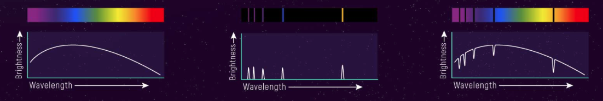

## Course repository for the ***Intro to Spectroscopy 2025*** Workshop 
taught for BRIEF Boyce Astro Foundation by Chandru Narayan. (updated aug 23, 2025)


### BAROSpection - Introduction to Spectroscopy [course flyer](docs/barospection_flyer.png)


---

### [SLACK CHANNEL FOR ALL COMMUNICATIONS](https://briefprograms.slack.com/archives/C0918TX0SVC)! - Please look here for Q&A


### NEWS - READ THIS SECTION BELOW FOR UPDATES EACH TIME!
- Aug 23rd: [Meeting recordings added](https://drunarayan.github.io/barospection/#workshop-meeting-and-recording-links). I will be creating this week's assignment later today and posting it.
- Aug 21st: [Tonight's BONUS session by Mr Tom Field, the creator of the excellent RSpec software](https://drunarayan.github.io/barospection/#workshop-meeting-and-recording-links). Tom will do a an informal and friendly video walkthrough of RSpec. It is recommended that you have RSpec download and installed on your Windows system duringhis talk so that you can try it out LIVE!
- Aug 21st: [2nd round of imaging Spectra. See here for details!](./news/aug21/readme.md)
- Aug 20th: [Student Contributions added!](student_solutions/readme.md) Also added a new [OPTIONAL Session on September 4th where Dr. Demis John will talk to us about Photonics!](#workshop-meeting-and-recording-links)  Please make every effort to attend!
- Aug 19th: [Dropbox folder with all images captured on Aug 15th](#dropbox-link-and-instructions-for-access-to-spectral-images)
- Aug 17th: [Video of Aug 15 Friday sessions](#workshop-meeting-and-recording-links) and [Course Assignments](#python-for-spectroscopy-course-content-notebooks--assignments) posted!
- Aug 17th: [Migration to Slack Channel for all future communications!](news/aug17) 
- Aug 15th: [Workshop commences 6:30 PM Pacific Time Friday, Aug 15th, 2025. See below for full details](#workshop-meeting-and-recording-links)
- Aug 10th: [A Cosmic Perspective](cosmic_perspective) - please read this account written by one of my high school students


Our workshop will cover a smattering of interesting or historically significant Spectroscopy topics in no particular sequence.  However, the main goal of this course is to teach critical college and research skills that you will need as a student & professional. We will attempt to develop these skills primarily on Spectroscopy related topics as you clearly are astro enthusiasts!  The primary audience for this course are High/Middle School, College students, or Early Career professionals. We also care about accessibility of these resources across student communities who may be underrepresented and of a diverse socio economic background. We hope to keep these resources free and open for use as much as possible to anyone who may be interested.  Please contact me at drunarayan@gmail.com if you would like to learn more about this course.

Skills we will teach include:
1. Jupyter Notebooks (the backbone of JupyterLab)
1. JupyterHub & JupyterLab (dev environment for Jupyter Notebooks adopted widely by universities)
1. Markdown Syntax (dynamic text, images, video and code embedded publishing)
1. LaTeX (web and github enables equation editor for research)
1. Python (language of choice for data science and STEM publications)
1. Matplotlib (plotting large amounts of data)
1. Pandas & Numpy (dataframes and math libraries for Python)
1. SQL (structured query language for querying astro databases)

We expect to run for a total of 5 sessions ***every Friday starting Aug 15th, 2025***. Look for a Google Meet schedule links to be available at this page ahead of the workshop start date. 

Please check this link below for ALL UPDATES.  I will try not to send emails or notifications for any updates.  All materials will show up on this link below.  So please bookmark it check it frequently. 

## What is Jupyter?

If you are not familiar with [Project Jupyter](http://jupyter.org/), and [JupyterHub](http://jupyter.org/hub), I highly recommend learning about them by following the embedded links.  

All of the content provided here are accessible to you using a combination of technologies provided by [Jupyter](http://jupyter.org/) and [Github](https://github.com/) where 83+ million researchers around the world come together to publish the share their work.  

You will be accessing your own 'virtual laptop' hosted on a Google virtual machine somewhere in the globe to do your work.  You class materials will be available to you there and you will store the products of your learning there and not on your physical computer from which you are accessing this course. Your work will be to modify the Jupyter Notebooks to add text, images, video, to write your own code, query and retrieve astronomical databases, analyze and plot your results graphically.

## Create your JupyterLab Login for use later!

You will be logging into JupyterHub for getting workshop materials and creating your own Jupyter Notebooks.  Your username is simply ```<your first name>.``` followed by the word ```p4b```. For instance, my username would be ```chandru.p4b```. ***See & use the created usernames below. The first time you log in, create and type in any password you make up yourself.***  That will become your actual password for this JupyterHub - please try not to forget it.  If you do, email me at drunarayan@gmail.com, I will reset it.  Please see created usernames below.

## User Names & Star Assignments created for the Fall 2025 Class

### Students, Star Assignments, Usernames, Status
if your status shows <span style="color:red;">pending</span> you did not start the course and you will need to contact me by email drunarayan@gmail.com to continue in the workshop. 

First|Last|Assigned Star|username|status
---|---|---|---|---|
Anisha|Bajaj|Altair|anisha.p4b|current
Louis|Petersen|Vega|louis.p4b|current
Dhruv|Mehrotra|Dubhe|dhruv.p4b|current
Kripita|Srivatsava|Alioth|kripita.p4b|current
Jacob|John|Mizar|jacob.p4b|current
Maya|McGreevy|R Lyra|maya.p4b|current
Pranav|Muthukumaran|Rasalgethi|pranav.p4b|<span style="color:red;">pending</span>
Abbas|Mokhtarzadeh|Alcor|abbas.p4b|current
Nicholas|Bettwy|Alpheratz|nicholas.p4b|current
Heinz|Valbruch|Albireo A|heinz.p4b|current
Adam|Brown|R Lyra|adam.p4b|current
Ahmad|Naeem|<span style="color:red;"><del>Zosma</del></span> <ins>h Uma</ins>|ahmad.p4b|current
Richard |Jaworski|Alioth|richard.p4b|current
Ronald|Lawrence|<span style="color:red;"><del>Minelauva</del></span> <ins>Polaris|ronald.p4b|current
Christopher|Rowe|Arcturus|christopher.p4b|current
Dave|Dobrotka|Rasalhague|dave.p4b|current
Tom|Smith|P Cygnus|tom.p4b|current
Pat|Boyce|Polaris|pat.p4b|current
Grady|Boyce|Zeta1 Lyra|grady.p4b|<span style="color:red;">pending</span>
Puneeth|Sethi|Kochab|puneeth.p4b|current
Shalini|Sankarkumar|Alpheratz|shalini.p4b|current
Ayush |Roy|P Cygnus|ayush.p4b|<span style="color:red;">pending</span>
Miracle|Marcel|Altair|miracle.p4b|<span style="color:red;">pending</span>
Jae|Calanog|Dschubba|jae.p4b|current
Girish|Bajaj|Enif|girish.p4b|current
John|Petersen|Alphecca|john.p4b|current
Sumit|Mehrotra|Alkaid|sumit.p4b|current
Demis|John|Mizar|demis.p4b|current
Rajaabarami|Rajakumar|Zeta1 Lyra|rajaabarami.p4b|current
Rishwanth|Babu|Rasalhague|rishwanth.p4b|<span style="color:red;">pending</span>
Priyanka|Sindhu|<span style="color:red;"><del>Zosma</del></span> <ins>h Uma</ins>|priyanka.p4b|current
Geoff|Stone|Alioth|geoff.p4b|current
Pranav|Muthukumaran|Rasalgethi|pranav.p4b|<span style="color:red;">pending</span>
Karissa|Belzer|<span style="color:red;"><del>Minelauva</del></span><ins> Rasalgethi</ins>|karissa.p4b|current
Salem|Sherman|Alkaid|salem.p4b|<span style="color:red;">dropped</span>
Yaritza|Villa|Vega|yaritza.p4b|<span style="color:red;">pending</span>
Ricks|Shobs|Altair|ricks.p4b|current
Reed|Estrada|Zeta1 Lyra|reed.p4b|current
Mark|Harris|Rasalgethi|mark.p4b|<span style="color:red;">pending</span>
Cam|Narayan|Polaris|cam.p4b|<span style="color:red;">pending</span>
Tom|Field|Eltanin|tomf.p4b|current

## [Click here to see Student Submissions!](student_solutions/readme.md)

## Workshop organization & JupyterLab - your own virtual laptop in the sky!

The structure of this Workshop includes specific ***Projects*** below.  These Projects provide access to multiple materials, including **your own virtual laptop**, Jupyter Notebooks, media files (images, video), presentations, PDF files, CSV files, database files and the like.  Each Project wil have its own collection of content linked below.  When you click on the very first project link below to get started!

When you do so, it will make your own initial copy to your JupyterHub account and allow you to edit and modify them.  As you modify them, ***JupyterLab*** (the IDE inside JupyterHub) will keep track of the modifications and you ***should never lose your edits***.  It is highly recommended that you ***do not change the names of the notebooks or files*** as they are being tracked and version controlled. You can always return to this page to access any specific project below where you can access your latest edits.  JupyterHub is widely used and state-of-the-art mechanism that universities use to manage Jupyter Notebooks and other course materials.  It is expected that future courses taught by me for BRIEF Programs will provide access to the same user account you are using now.

## Availability of JupyterLab Virtual Machine (Your Virtual Laptop)

***Your virtual laptops will be online and available Wednesday Morning 8:00 AM Pacific to Sunday Evening 11:00 PM Pacific each week.  You will be able to login during these times and complete your assignments ahead of, during and after the web meeting sessions each week.***  At other times, the virtual machine will be taken down to reduce the cost of using the Google Cloud. If you have a special need, you can contact me and I will try and make accommodations.

## Projects & Materials Access
#### Please complete these steps including ``Project 0`` ahead of the first session

* [Access Online OpenStax Astronomy Textbook here](https://openstax.org/books/astronomy-2e/pages/1-introduction)
* Complete ```Project 0-3: First Login to Jupyter & Slack and other introductory assignments``` which should be available for you to create your first lines of code in Markdown & Python for this class.  I encourage you to click each of the Project 0-3 Notebooks below, ***login with your username and password as identified in the previous paragraphs***. See if you can complete these ahead of our first 2 introductory sessions!

## Dropbox link and instructions for access to Spectral Images

### [Click Dropbox Link here for access to Images](https://www.dropbox.com/scl/fo/hvf0pk8xs5x4f0lrquvkl/ALFW_pY5oaAEs4Xi_Kv9WlA?rlkey=tyyn7sl0gpr224h9983qqsvuh&st=j7o9hmzq&dl=0)
1. You do not need a Dropbox accout to access images!
1. Click the link above. It will open in your default browser.

1. First click down to the "Images" Folder. In the Browser. You will have choices to download
    1. Click down to your "star folder" under "Images" folder. Then Download your specific "Star" folder or some other "Star" folder. You will get a zip file which you can extract on your system.
    1. Download the entire "Images" Folder.  You will get a zip file which you can extract on your system. Be warned - this is several GB and wmight take a very long time. Although we may not exceed this limit, Dropbox will prevent you from downloading more than 20GB

### Class Star Target List for Spectra, Adjusted RA/Dec and Imaging Status 

Target Name|HD Number|Adj RA|Adj Dec|Magnitude|Calculated Exposure|Status
---|---|---|---|---|---|---
Rasalhague_HD_159561_Typ_A5|HD 159561|263.7891|12.5383|2.07|3.74|Imaged 8-15-2025
Rasalgethi_HD_156014_Typ_M5|HD 156014|258.7178|14.3686|5.3|64.60|Imaged 8-15-2025
Altair_HD_187642_Typ_A7|HD 187642|297.7506|8.8466|0.76|1.18|Imaged 8-15-2025
Vega_HD_172167_Typ_A0|HD 172167|279.3041|38.7619|0.026|0.62|Imaged 8-15-2025
Dubhe_HD_95689_Typ_K0|HD 95689|166.0462|61.7292|1.79|2.92|Imaged 8-20-2025
Scheat_HD_217906_Typ_M2|HD 217906|346.0049|28.0610|2.42|5.09|Imaged 8-15-2025
Mizar_HD_116656_Typ_A2|HD 116656|201.0756|54.9036|2.04|3.64|Imaged 8-20-2025
Alcor_HD_116657_Typ_MK|HD 116657|201.4007|54.9662|3.88|18.46|Imaged 8-15-2025 & 8-20-2025
R_Lyr_HD_175865_Typ_M5|HD 175865|283.9089|43.9243|3.9|18.79|Imaged 8-15-2025
Alpheratz_HD_358_Typ_B8_A7|HD 358|2.1588|29.0687|2.06|3.70|Imaged 8-15-2025
Albireo_HD_183912_Typ_K2|HD 183912|292.7416|27.9379|3.21|10.22|Imaged 8-15-2025
Albireo_HD_183913_Typ_B8|HD 183913|292.7416|27.9379|5.11|54.63|Imaged 8-15-2025
Denebola_HD_102647_Typ_A3|HD 102647|177.3208|14.5503|2.14|3.98|<span style="color:red;">Pending</span>
Zosma_HD_97603_Typ_A4|HD 97603|168.5849|20.5020|2.56|5.76|<span style="color:red;">Pending</span>
Alioth_HD_112185_Typ_A1|HD 112185|193.6039|55.9380|1.77|2.87|Imaged 8-20-2025
Minelauva_HD_112300_Typ_M3|HD 112300|193.9551|3.3757|3.32|11.26|<span style="color:red;">Pending</span>
Arcturus_HD_124897_Typ_K1|HD 124897|213.9726|19.1606|-0.05|0.58|Imaged 8-20-2025
P_Cyg_HD_193237_Typ_B1|HD 193237|304.5154|38.0112|4.82|42.30|Imaged 8-15-2025
Polaris_HD_8890_Typ_F7|HD 8890|42.0407|89.2404|1.98|3.45|Imaged 8-20-2025
Zet1_Lyr_HD_173648_Typ_kA5|HD 173648|281.2615|37.5833|4.37|28.44|Imaged 8-15-2025
Zet2_Lyr_HD_173649_Typ_F0|HD 173649|281.2691|37.5728|5.74|95.25|Imaged 8-15-2025
Kochab_HD_131873_Typ_K4|HD 131873|222.8743|74.1337|2.08|3.77|Imaged 8-20-2025
Dschubba_HD_143275_Typ_B0|HD 143275|240.1420|-22.6435|1.59|2.45|Imaged 8-20-2025
Enif_HD_206778_Typ_K2|HD 206778|326.1014|9.8532|2.37|4.87|Imaged 8-15-2025
Alphecca_HD_139006_Typ_A0|HD 139006|233.7325|26.6929|2.24|4.34|Imaged 8-15-2025
Eltanin_HD_164058_Typ_K5|HD 164058|269.2384|51.4671|2.23|4.30|Imaged 8-15-2025
Thuban_HD_123299_Typ_A0|HD 123299|211.2224|64.3541|3.67|15.33|Imaged 8-20-2025
h_Uma_HD_81937_Typ_F0|HD 81937|143.0015|63.0401|3.65|15.07|Imaged 8-20-2025
Theta_Cep_HD_195725_Typ_A7|HD 195725|307.5145|62.9723|4.22|24.91|Imaged 8-15-2025
VZ_Cam_HD_55966_Typ_M4|HD 55966|113.1773|82.3895|4.92|46.20|<span style="color:red;">Pending</span>
Erakis_HD_206936_Typ_M2|HD 206936|325.9813|58.7582|4.08|22.02|Imaged 8-15-2025
42_Her_HD_150450_Typ_M2|HD 150450|249.7692|48.9066|4.86|43.82|Imaged 8-15-2025
V906_Her_HD_150409_Typ_Ma|HD 150409|249.7178|48.8405|6.6|203.42|Imaged 8-15-2025 & 8-20-2025
3C273_Quasar_3C273_Typ_Qu|Quasar_3C273|187.3321|2.0306|12.9|52772.22|<span style="color:red;">Pending</span>
Neptune_Neptune_Typ_Pl|Neptune|0.1331|-1.3658|7.8|586.41|Imaged 8-15-2025
Saturn_Saturn_Typ_Pl|Saturn|1.6737|-1.9659|0.99|1.44|<span style="color:red;">Pending</span>
Uranus_Uranus_Typ_Pl|Uranus|52.5611|18.6892|5.75|96.09|<span style="color:red;">Pending</span>


### Python for Spectroscopy Course Content Notebooks & Assignments

Project|Topics|Notebook|Due Date|Partial Solution|
---|---|---|---|---|
0.0.|First Access to Slack  - Make your first contribution to Slack about your assigned Star!|[Slack](https://briefprograms.slack.com/archives/C0918TX0SVC){:target="_blank"} | 8/20/25|None
0.1.|First Login to JupyterHub  - Hand compute celestial coordinates for your assigned star|[Hand Compute CC](https://boyceastrows.gleeze.com/hub/user-redirect/git-pull?repo=https%3A%2F%2Fgithub.com%2Fdrunarayan%2Fbarospection&branch=gh-pages&urlpath=lab%2Ftree%2Fbarospection%2Fnotebooks%2F00_hand_compute_cc.ipynb?reset){:target="_blank"} | 8/20/25|[View Only](https://nbviewer.org/github/drunarayan/barospection/blob/gh-pages/student_solutions/chandru/soln_00_hand_compute_cc.ipynb?flush_cache=true){:target="_blank"}
0.2.|What is JupyterLab - Jupyter Notebooks - Learn Basics|[Intro to Jupyter](https://boyceastrows.gleeze.com/hub/user-redirect/git-pull?repo=https%3A%2F%2Fgithub.com%2Fdrunarayan%2Fbarospection&branch=gh-pages&urlpath=lab%2Ftree%2Fbarospection%2Fnotebooks%2F01_jupyter_notebooks.ipynb?reset){:target="_blank"} | 8/20/25|[View Only](https://nbviewer.org/github/drunarayan/barospection/blob/gh-pages/notebooks/01_jupyter_notebooks.ipynb?flush_cache=true){:target="_blank"}
1.|Introduction to coding Python inside JupyterLab|[Intro to Python Part 1](https://boyceastrows.gleeze.com/hub/user-redirect/git-pull?repo=https%3A%2F%2Fgithub.com%2Fdrunarayan%2Fbarospection&branch=gh-pages&urlpath=lab%2Ftree%2Fbarospection%2Fnotebooks%2F02_Python.ipynb?reset){:target="_blank"} |8/20/25 |[View Only](https://nbviewer.org/github/drunarayan/barospection/blob/gh-pages/notebooks/02_Python.ipynb){:target="_blank"}
2.|Compute Celestial Coordinates to obtain Live Spectra of Stars|[Celestial Coordinates](https://boyceastrows.gleeze.com/hub/user-redirect/git-pull?repo=https%3A%2F%2Fgithub.com%2Fdrunarayan%2Fbarospection&branch=gh-pages&urlpath=lab%2Ftree%2Fbarospection%2Fnotebooks%2F02B_Celestial_Coordinates.ipynb?reset){:target="_blank"} | 8/20/25|[View Only](https://nbviewer.org/github/drunarayan/barospection/blob/gh-pages/notebooks/02B_Celestial_Coordinates.ipynb){:target="_blank"}
3.|Install the RSpec Application on your Windows system for analysis of your star spectra. Please include word "BAROspection" in the form for download |[RSpec download & Install](https://rspec-astro.com/setupdownload/){:target="_blank"} | 8/21/25| None
4.|More Advanced topics in Python|[Intro to Python Part 2](https://boyceastrows.gleeze.com/hub/user-redirect/git-pull?repo=https%3A%2F%2Fgithub.com%2Fdrunarayan%2Fbarospection&branch=gh-pages&urlpath=lab%2Ftree%2Fbarospection%2Fnotebooks%2F02C_Python.ipynb?reset){:target="_blank"} | None. For reference and help only|[View Only](https://nbviewer.org/github/drunarayan/barospection/blob/gh-pages/notebooks/02C_Python.ipynb){:target="_blank"}
5.|Numpy and Pandas libraries for numerical calculations and learning to use Dataframes|[Intro to Numpy](https://boyceastrows.gleeze.com/hub/user-redirect/git-pull?repo=https%3A%2F%2Fgithub.com%2Fdrunarayan%2Fbarospection&branch=gh-pages&urlpath=lab%2Ftree%2Fbarospection%2Fnotebooks%2F03_numpy.ipynb?reset){:target="_blank"} | TBD|[View Only](https://nbviewer.org/github/drunarayan/barospection/blob/gh-pages/notebooks/03_numpy.ipynb){:target="_blank"}
6.|Visualizations and Animations|[Intro to Visualization](https://boyceastrows.gleeze.com/hub/user-redirect/git-pull?repo=https%3A%2F%2Fgithub.com%2Fdrunarayan%2Fbarospection&branch=gh-pages&urlpath=lab%2Ftree%2Fbarospection%2Fnotebooks%2F04_Visualization.ipynb?reset){:target="_blank"} |TBD |[View Only](https://nbviewer.org/github/drunarayan/barospection/blob/gh-pages/notebooks/04_Visualization.ipynb){:target="_blank"}

### Light & Matter and Electromagnetism
1. What is Light?
1. Electromagnetic Waves
1. Photons & Matter
1. Class Jupyter Notebook - [Light Basics](https://boyceastrows.gleeze.com/hub/user-redirect/git-pull?repo=https%3A%2F%2Fgithub.com%2Fdrunarayan%2Fbarospection&branch=gh-pages&urlpath=lab%2Ftree%2Fbarospection%2Fnotebooks%2Flight_basics.ipynb?reset){:target="_blank"} | [View Only](https://nbviewer.org/github/drunarayan/barospection/blob/gh-pages/notebooks/light_basics.ipynb){:target="_blank"}
1. Assignment Jupyter Notebook - [Light Basics Assignment](https://boyceastrows.gleeze.com/hub/user-redirect/git-pull?repo=https%3A%2F%2Fgithub.com%2Fdrunarayan%2Fbarospection&branch=gh-pages&urlpath=lab%2Ftree%2Fbarospection%2Fnotebooks%2Flight_basics_assignment.ipynb?reset){:target="_blank"} | [View Only](https://nbviewer.org/github/drunarayan/barospection/blob/gh-pages/notebooks/light_basics_assignment.ipynb){:target="_blank"}

### Light & Matter Interactions
1.  What is a Blackbody 
1.  Electromagnetic Spectrum
1.  Modeling a Black Body
1.  Waves & Particles
1. Jupyter Notebook - [Light & Matter Interactions](https://boyceastrows.gleeze.com/hub/user-redirect/git-pull?repo=https%3A%2F%2Fgithub.com%2Fdrunarayan%2Fbarospection&branch=gh-pages&urlpath=lab%2Ftree%2Fbarospection%2Fnotebooks%2Flight_matter_interactions.ipynb?reset){:target="_blank"} | [View Only](https://nbviewer.org/github/drunarayan/barospection/blob/gh-pages/notebooks/light_matter_interactions.ipynb){:target="_blank"}

### Spectroscopy
1. What is Spectroscopy
1. Types of Spectra
    1. Continuous Spectrum
    1. Absorption Spectrum
    1. Emission Spectrum
1. Source of Spectral Lines
1. Calculating Balmer's Constant
1. Doppler Effect on Spectral Lines
1. Jupyter Notebook - [Absorption & Emission Spectra](https://boyceastrows.gleeze.com/hub/user-redirect/git-pull?repo=https%3A%2F%2Fgithub.com%2Fdrunarayan%2Fbarospection&branch=gh-pages&urlpath=lab%2Ftree%2Fbarospection%2Fnotebooks%2Fmatter_absorption_emission.ipynb?reset){:target="_blank"} | [View Only](https://nbviewer.org/github/drunarayan/barospection/blob/gh-pages/notebooks/matter_absorption_emission.ipynb){:target="_blank"}

### Star Properties
1. Star Types
1. What can you learn from Star Spectra
2. HertzSprung Russell Diagram (HRD)
3. Plot an HRD for Sun's 100 Parsec neighbourhood
1. Jupyter Notebook - HRD

### Obtain Spectra from the BARO Telescope
1. Spectral Grating configuration on BARO
1. Selecting Targets in the Solar Neiborhood
1. Create Target List for Hot & Cool Stars & Nebulae
1. Schedule to obtain Spectra
1. Calibrate using [RSpec](https://rspec-astro.com/) 

### Analyze & Publish Sprectral Images
1. Use RSpec to Analyze Spectral Lines
1. Measure Wavelenghts & Frequencies
1. Measure Shift in Spectral Lines
1. Compare against NIST Standard
1. Publish yoiur results in a Jupyter Notebook
1. Post examples to [RSpec website](https://rspec-astro.com/)


## Workshop Meeting and Recording Links 

Item|Status|Date|Topic|Google Meet Link|Google Recording Link
---|---|---|---|---|---
1a|<span style="color:red;">COMPLETE</span>|Fri, Aug 15, 2025 6:30 - 8:00 PM Pacific Time|Intro to Spectroscopy & Jupyter Notebooks|[Google Meet link](https://meet.google.com/hwo-ttfv-smv)|The recording from the following session contains the full 3.5 hours from Aug 15th
1b|<span style="color:red;">COMPLETE</span>|Fri, Aug 15, 2025 8:00 - 11:00 PM Pacific Time|OPTIONAL - Obtain Spectra from BARO telescope|[Google Meet link](https://meet.google.com/hwo-ttfv-smv)|[Google Meeting Recording](https://drive.google.com/file/d/18gcrqDIVmb6X6sJXX8UXVBMbA17a9oRf/view?usp=sharing)
2|<span style="color:blue;"><span style="color:red;">COMPLETE</span></span>|Thu, Aug 21, 2025 6:30 - 8:00 PM Pacific Time|OPTIONAL - Informal/Friendly Walkthrough of RSpec by Mr. Tom Field|[Zoom link](https://us02web.zoom.us/j/86288551677?pwd=pS1hZBz2puUwFNIY09FDK8eO7jVoDd.1)|[Tom Field's RSpec Meeting Recording](https://drive.google.com/file/d/1Gg6ZpX-YEi5o7WKnJGfxVzuD7VeSETUu/view?usp=sharing)
3|<span style="color:red;">COMPLETE</span>|Fri, Aug 22, 2025 6:30 - 8:00 PM Pacific Time|Light & Matter. Absorption & Emission Spectra & Types of Spectroscopy|[Google Meet link](https://meet.google.com/hwo-ttfv-smv)|[Google Meeting Recording](https://drive.google.com/file/d/1yFlXBCa7sInJYz69scd34WixzsrwJGYm/view?usp=sharing)
4|<span style="color:green;">UPCOMING</span>|Fri, Aug 29, 2025 6:30 - 8:00 PM Pacific Time|Star Classifications and RSpec analysis of BARO spectra obtained|[Google Meet link](https://meet.google.com/hwo-ttfv-smv)|Google Meeting Recording TBA
5|<span style="color:green;">UPCOMING</span>|Fri, Sep 04, 2025 6:30 - 8:00 PM Pacific Time| OPTIONAL - Photonics Guest Lecture by Demis John!!|[Google Meet link](https://meet.google.com/hwo-ttfv-smv)|Google Meeting Recording TBA
6|<span style="color:green;">UPCOMING</span>|Fri, Sep 05, 2025 6:30 - 8:00 PM Pacific Time| Properties of Stars and Galaxies using Spectra|[Google Meet link](https://meet.google.com/hwo-ttfv-smv)|Google Meeting Recording TBA
7|<span style="color:green;">UPCOMING</span>|Fri, Sep 12, 2025 6:30 - 8:00 PM Pacific Time|Share our final results by sharing our published data in Jupyter Notebooks|[Google Meet link](https://meet.google.com/hwo-ttfv-smv)|Google Meeting Recording TBA


