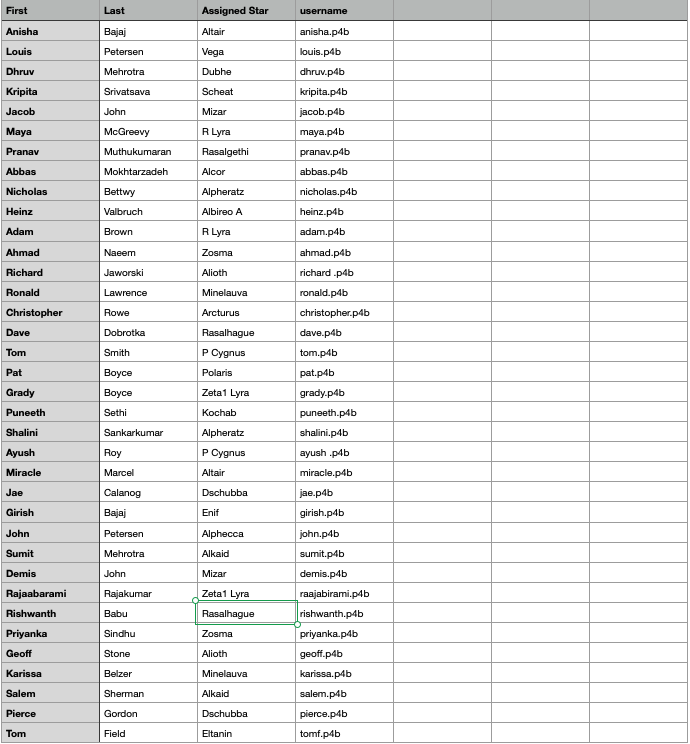

## Course repository for the ***Intro to Spectroscopy 2025*** Workshop 
taught for BRIEF Boyce Astro Foundation by Chandru Narayan

### BAROSpection - Introduction to Spectroscopy [course flyer](docs/barospection_flyer.png)

### Students and Star Assignments

### Class Star Target List for Spectra and their Adjusted RA and Dec 
Target Name|HD Number|Adj RA|Adj Dec|Magnitude|Calculated Exposure
---|---|---|---|---|---
Rasalhague_HD_159561_Typ_A5|HD 159561|263.7891|12.5383|2.07|3.74
Rasalgethi_HD_156014_Typ_M5|HD 156014|258.7178|14.3686|5.3|64.60
Altair_HD_187642_Typ_A7|HD 187642|297.7506|8.8466|0.76|1.18
Vega_HD_172167_Typ_A0|HD 172167|279.3041|38.7619|0.026|0.62
Dubhe_HD_95689_Typ_K0|HD 95689|166.0462|61.7292|1.79|2.92
Scheat_HD_217906_Typ_M2|HD 217906|346.0049|28.0610|2.42|5.09
Mizar_HD_116656_Typ_A2|HD 116656|201.0756|54.9036|2.04|3.64
Alcor_HD_116657_Typ_MK|HD 116657|201.4007|54.9662|3.88|18.46
R_Lyr_HD_175865_Typ_M5|HD 175865|283.9089|43.9243|3.9|18.79
Alpheratz_HD_358_Typ_B8_A7|HD 358|2.1588|29.0687|2.06|3.70
Albireo_HD_183912_Typ_K2|HD 183912|292.7416|27.9379|3.21|10.22
Albireo_HD_183913_Typ_B8|HD 183913|292.7416|27.9379|5.11|54.63
Denebola_HD_102647_Typ_A3|HD 102647|177.3208|14.5503|2.14|3.98
Zosma_HD_97603_Typ_A4|HD 97603|168.5849|20.5020|2.56|5.76
Alioth_HD_112185_Typ_A1|HD 112185|193.6039|55.9380|1.77|2.87
Minelauva_HD_112300_Typ_M3|HD 112300|193.9551|3.3757|3.32|11.26
Arcturus_HD_124897_Typ_K1|HD 124897|213.9726|19.1606|-0.05|0.58
P_Cyg_HD_193237_Typ_B1|HD 193237|304.5154|38.0112|4.82|42.30
Polaris_HD_8890_Typ_F7|HD 8890|42.0407|89.2404|1.98|3.45
Zet1_Lyr_HD_173648_Typ_kA5|HD 173648|281.2615|37.5833|4.37|28.44
Zet2_Lyr_HD_173649_Typ_F0|HD 173649|281.2691|37.5728|5.74|95.25
Kochab_HD_131873_Typ_K4|HD 131873|222.8743|74.1337|2.08|3.77
Dschubba_HD_143275_Typ_B0|HD 143275|240.1420|-22.6435|1.59|2.45
Enif_HD_206778_Typ_K2|HD 206778|326.1014|9.8532|2.37|4.87
Alphecca_HD_139006_Typ_A0|HD 139006|233.7325|26.6929|2.24|4.34
Eltanin_HD_164058_Typ_K5|HD 164058|269.2384|51.4671|2.23|4.30

### Introduction & References for using Python in Spectroscopy
1. Jupyter Notebook - [Intro to Jupyter](https://boyceastrows.gleeze.com/hub/user-redirect/git-pull?repo=https%3A%2F%2Fgithub.com%2Fdrunarayan%2Fbarospection&branch=gh-pages&urlpath=lab%2Ftree%2Fbarospection%2Fnotebooks%2F01_jupyter_notebooks.ipynb?reset){:target="_blank"} | [View Only](https://nbviewer.org/github/drunarayan/barospection/blob/gh-pages/notebooks/01_jupyter_notebooks.ipynb?flush_cache=true){:target="_blank"}
1. Jupyter Notebook - [Intro to Python](https://boyceastrows.gleeze.com/hub/user-redirect/git-pull?repo=https%3A%2F%2Fgithub.com%2Fdrunarayan%2Fbarospection&branch=gh-pages&urlpath=lab%2Ftree%2Fbarospection%2Fnotebooks%2F02_Python.ipynb?reset){:target="_blank"} | [View Only](https://nbviewer.org/github/drunarayan/barospection/blob/gh-pages/notebooks/02_Python.ipynb){:target="_blank"}
1. Jupyter Notebook - [Celestial Coordinates](https://boyceastrows.gleeze.com/hub/user-redirect/git-pull?repo=https%3A%2F%2Fgithub.com%2Fdrunarayan%2Fbarospection&branch=gh-pages&urlpath=lab%2Ftree%2Fbarospection%2Fnotebooks%2F02B_Celestial_Coordinates.ipynb?reset){:target="_blank"} | [View Only](https://nbviewer.org/github/drunarayan/barospection/blob/gh-pages/notebooks/2B_Celestial_Coordinates.ipynb){:target="_blank"}
1. Jupyter Notebook - [Intro to Python](https://boyceastrows.gleeze.com/hub/user-redirect/git-pull?repo=https%3A%2F%2Fgithub.com%2Fdrunarayan%2Fbarospection&branch=gh-pages&urlpath=lab%2Ftree%2Fbarospection%2Fnotebooks%2F02C_Python.ipynb?reset){:target="_blank"} | [View Only](https://nbviewer.org/github/drunarayan/barospection/blob/gh-pages/notebooks/02C_Python.ipynb){:target="_blank"}
1. Jupyter Notebook - [Intro to Numpy](https://boyceastrows.gleeze.com/hub/user-redirect/git-pull?repo=https%3A%2F%2Fgithub.com%2Fdrunarayan%2Fbarospection&branch=gh-pages&urlpath=lab%2Ftree%2Fbarospection%2Fnotebooks%2F03_numpy.ipynb?reset){:target="_blank"} | [View Only](https://nbviewer.org/github/drunarayan/barospection/blob/gh-pages/notebooks/03_numpy.ipynb){:target="_blank"}
1. Jupyter Notebook - [Intro to Visualization](https://boyceastrows.gleeze.com/hub/user-redirect/git-pull?repo=https%3A%2F%2Fgithub.com%2Fdrunarayan%2Fbarospection&branch=gh-pages&urlpath=lab%2Ftree%2Fbarospection%2Fnotebooks%2F04_Visualization.ipynb?reset){:target="_blank"} | [View Only](https://nbviewer.org/github/drunarayan/barospection/blob/gh-pages/notebooks/04_Visualization.ipynb){:target="_blank"}

### Introduction to Light & Matter and Electromagnetism
1. What is Light?
1. Electromagnetic Waves
1. Photons & Matter
1. Jupyter Notebook - [Light Basics](https://boyceastrows.gleeze.com/hub/user-redirect/git-pull?repo=https%3A%2F%2Fgithub.com%2Fdrunarayan%2Fbarospection&branch=gh-pages&urlpath=lab%2Ftree%2Fbarospection%2Fnotebooks%2Flight_basics.ipynb?reset){:target="_blank"} | [View Only](https://nbviewer.org/github/drunarayan/barospection/blob/gh-pages/notebooks/light_basics.ipynb){:target="_blank"}

### Light & Matter Interactions
1.  What is a Blackbody 
1.  Electromagnetic Spectrum
1.  Modeling a Black Body
1.  Waves & Particles
1. Jupyter Notebook - [Light & Matter Interactions](https://boyceastrows.gleeze.com/hub/user-redirect/git-pull?repo=https%3A%2F%2Fgithub.com%2Fdrunarayan%2Fbarospection&branch=gh-pages&urlpath=lab%2Ftree%2Fbarospection%2Fnotebooks%2Flight_matter_interactions.ipynb?reset){:target="_blank"} | [View Only](https://nbviewer.org/github/drunarayan/barospection/blob/gh-pages/notebooks/light_matter_interactions.ipynb){:target="_blank"}

### Spectroscopy
1. What is Spectroscopy
1. Types of Spectra
    1. Continuous Spectrum
    1. Absorption Spectrum
    1. Emission Spectrum
1. Source of Spectral Lines
1. Calculating Balmer's Constant
1. Doppler Effect on Spectral Lines
1. Jupyter Notebook - [Absorption & Emission Spectra](https://boyceastrows.gleeze.com/hub/user-redirect/git-pull?repo=https%3A%2F%2Fgithub.com%2Fdrunarayan%2Fbarospection&branch=gh-pages&urlpath=lab%2Ftree%2Fbarospection%2Fnotebooks%2Fmatter_absorption_emission.ipynb?reset){:target="_blank"} | [View Only](https://nbviewer.org/github/drunarayan/barospection/blob/gh-pages/notebooks/matter_absorption_emission.ipynb){:target="_blank"}

### Star Properties
1. Star Types
1. What can you learn from Star Spectra
2. HertzSprung Russell Diagram (HRD)
3. Plot an HRD for Sun's 100 Parsec neighbourhood
1. Jupyter Notebook - HRD

### Obtain Spectra from the BARO Telescope
1. Spectral Grating configuration on BARO
1. Selecting Targets in the Solar Neiborhood
1. Create Target List for Hot & Cool Stars & Nebulae
1. Schedule to obtain Spectra
1. Calibrate using [RSpec](https://rspec-astro.com/) 

### Analyze & Publish Sprectral Images
1. Use RSpec to Analyze Spectral Lines
1. Measure Wavelenghts & Frequencies
1. Measure Shift in Spectral Lines
1. Compare against NIST Standard
1. Publish yoiur results in a Jupyter Notebook
1. Post examples to [RSpec website](https://rspec-astro.com/)

### ***Workshop commences 7:00 PM Pacific Time Fri, Aug 15, 2025 for 5 weekly sessions. See below for details***

In this workshop we will cover introductory and historically significant Spectroscopy topics.  We will not only learn the basics of Spectroscopy, we will also use the Boyce Astro BARO telescope to obtain spectra. Then we will analyze the spectra using [RSpec Software](https://rspec-astro.com/). 

We will attempt to develop research skills primarily on Spectroscopy related topics as you clearly are astro enthusiasts!  The primary audience for this course are High School, College students, or Early Career professionals. We also care about accessibility of these resources across student communities who may be underrepresented and of a diverse socio economic background. We hope to keep these resources free and open for use as much as possible to anyone who may be interested.  

Skills we will teach includes:
1. JupyterLab (dev environment for Jupyter Notebooks adopted widely by universities - logins for each student will be provided)
1. Markdown Syntax (dynamic text, images, video and code embedded publishing)
1. LaTeX (web and github enables equation editor for research)
1. Python (language of choice for data science and STEM publications)
1. Matplotlib (plotting large amounts of data)
1. Pandas & Numpy (dataframes and math libraries for Python)

We expect to run for 5 sessions ***every week starting Thursday Aug 7, 2025 ***. Look for the Google Meet schedule links to be available at the end of this page. 

Please check this website & classroom for ALL UPDATES.  I will try not to send emails or notifications for any updates.  All materials will show up on this link below.  So please bookmark it check it frequently. 

## Workshop Zoom Meeting and Recording Links 

Item|Date|Topic|Google Meet Link|Google Recording Link
---|---|---|---|---
1a|Fri, Aug 15, 2025 6:30 - 8:00 PM Pacific Time|Intro to Spectroscopy & Jupyter Notebooks|[Google Meet link](https://meet.google.com/hwo-ttfv-smv)|Google Meeting Recording TBA
1b|Fri, Aug 15, 2025 8:00 - 11:00 PM Pacific Time|OPTIONAL - Obtain Spectra from BARO telescope|[Google Meet link](https://meet.google.com/hwo-ttfv-smv)|Google Meeting Recording TBA
2|Fri, Aug 22, 2025 6:30 - 8:00 PM Pacific Time|Light & Matter. Absorption & Emission Spectra & Types of Spectroscopy|[Google Meet link](https://meet.google.com/hwo-ttfv-smv)|Google Meeting Recording TBA
3|Fri, Aug 29, 2025 6:30 - 8:00 PM Pacific Time|Star Classifications and RSpec analysis of BARO spectra obtained|[Google Meet link](https://meet.google.com/hwo-ttfv-smv)|Google Meeting Recording TBA
4|Fri, Sep 05, 2025 6:30 - 8:00 PM Pacific Time| Properties of Stars and Galaxies using Spectra|[Google Meet link](https://meet.google.com/hwo-ttfv-smv)|Google Meeting Recording TBA
5|Fri, Sep 12, 2025 6:30 - 8:00 PM Pacific Time|Share our final results by sharing our published data in Jupyter Notebooks|[Google Meet link](https://meet.google.com/hwo-ttfv-smv)|Google Meeting Recording TBA

