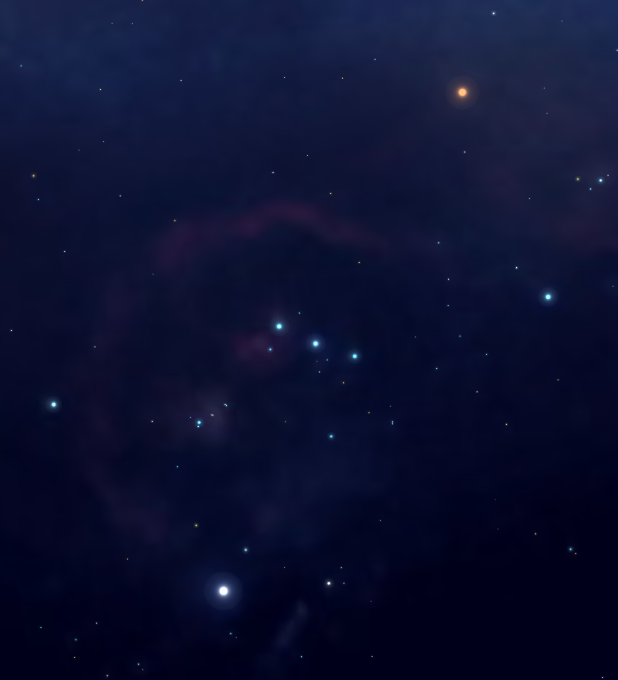
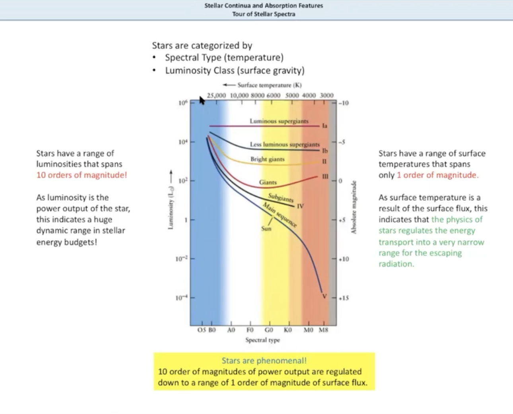
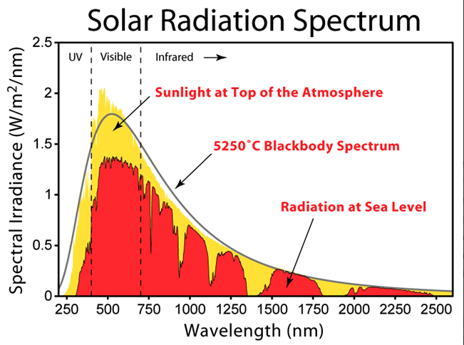

## Presentation Content for the BAROSpection seminar
### Stars are AMAZING!!!

### Behold the Power of STARS

### Light & Matter and Electromagnetism
1. What is Light?
1. Electromagnetic Waves
1. Photons & Matter
1. What is a Blackbody 

1. Electromagnetic Spectrum
1. [Modeling a Black Body](https://astro.unl.edu/classaction/animations/light/bbexplorer.html)
1. Waves & Particles
1. Class Jupyter Notebook - [Light Basics](https://boyceastrows.gleeze.com/hub/user-redirect/git-pull?repo=https%3A%2F%2Fgithub.com%2Fdrunarayan%2Fbarospection&branch=gh-pages&urlpath=lab%2Ftree%2Fbarospection%2Fnotebooks%2Flight_basics_assignment_with_rspec.ipynb?reset){:target="_blank"}

### Spectroscopy
1. What is Spectroscopy
1. [Types of Spectra](https://astro.unl.edu/classaction/animations/light/threeviewsspectra.html)
    1. Continuous Spectrum
    1. Absorption Spectrum
    1. Emission Spectrum
1. Source of Spectral Lines
1. Calculating Balmer's Constant
1. Doppler Effect on Spectral Lines
1. Jupyter Notebook - [Absorption & Emission Spectra](https://boyceastrows.gleeze.com/hub/user-redirect/git-pull?repo=https%3A%2F%2Fgithub.com%2Fdrunarayan%2Fbarospection&branch=gh-pages&urlpath=lab%2Ftree%2Fbarospection%2Fnotebooks%2Fmatter_absorption_emission.ipynb?reset){:target="_blank"}

### Star Properties
1. Star Types
1. What can you learn from Star Spectra
2. [HertzSprung Russell Diagram (HRD)](https://en.wikipedia.org/wiki/Main_sequence)
1. [HRD Explorer](https://astro.unl.edu/classaction/animations/stellarprops/hrexplorer.html)
3. Plot an HRD for Sun's 100 Parsec neighbourhood
1. Final Project - [Mystery Stars & HRD](https://drunarayan.github.io/barospection/notebooks/hrd_project.html)
1. [HRD Presentation](references/hrd_presentation.md)

### Obtain Live Spectra from the BARO Telescope
1. Spectral Grating configuration on BARO
1. Selecting Targets in the Solar Neiborhood
1. Create Target List for Hot & Cool Stars & Nebulae
1. Schedule to obtain Spectra
1. Calibrate using [RSpec](https://rspec-astro.com/) 

### Analyze & Publish Spectral Images using RSpec
1. [Annotated HR Diagram](https://people.highline.edu/iglozman/classes/astronotes/media/hr_diagram.jpg){:target="_blank"}
1. Use RSpec to Analyze Spectral Lines
1. Measure Wavelenghts & Frequencies
1. Measure Shift in Spectral Lines
1. Compare against NIST Standard
1. Publish your results in a Jupyter Notebook
1. Post examples to [RSpec website](https://rspec-astro.com/)
