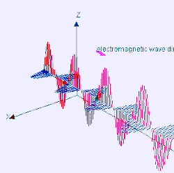
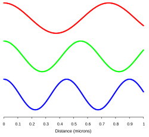

[Hyper Physics](http://hyperphysics.phy-astr.gsu.edu/hbase/hframe.html)

{:align="left"}
Electromagnetic waves can be imagined as a self-propagating transverse oscillating wave of electric and magnetic fields. This 3D animation shows a plane linearly polarized wave propagating from left to right. The electric and magnetic fields in such a wave are in phase with each other, reaching minima and maxima together.
{:clear="left"}

{:align="left"}
The relative wavelengths of the electromagnetic waves of three different colours of light (blue, green, and red) with a distance scale in micrometers along the x-axis.
{:clear="left"}

