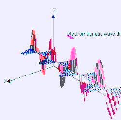
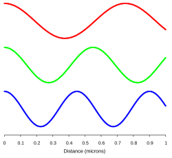

## References for BAROSpection seminar

### References for creating your descriptions about your calibration and assigned stars
1. <a href="http://www.astrosurf.com/heidemann/spectroscopie/spectroscopic_atlas_walker_4.pdf" download="spectroscopic_atlas_walker_4.pdf"  target="_blank" rel="noopener">Walker Spectroscopic Atlas from Astrosurf: </a> Use this amazing resource to look at professional calibrated spectra of stars of all types. This is a very useful document to use in your analysis of calibrated RSpec spectra of your star and identification stellar elements. Look up the Stellar type and see if you can identify absorption/emission features identified for the specific stellar type in your own spectrum. If you do identify it, annotate the spectrum with the wavelength and the element noted!  You will be using this reference to fully complete your annotated spectra and Jupyter Notebook assignment: ````light_basics_assignment_with_rspec.ipynb````.

1. The ````02B_Celestial_Coordinates.ipynb```` notebook you already completed contains a cell which produced many reference links that can also be used to get much more information about your star. These should be used to describe everything you discovered about your star with external pictures, text and any interesting observations. You will be using this reference to fully complete your annotated spectra and Jupyter Notebook assignment #4: ````light_basics_assignment_with_rspec.ipynb```` and beyond.

1. [Online OpenStax Astronomy Textbook](https://openstax.org/books/astronomy-2e/pages/1-introduction){:target="_blank"} An excelent online Astronomy textbook written and maintained by over 30 academics. I highly recommend that you use this resource for clarifications of concepts in Astronomy, and specifically Spectroscopy. I recommend reading Chapter 5 in its entireity.

1. [Astro 801](https://courses.ems.psu.edu/astro801/content) - A penn state online undergraduate study in Astronomy

1. <a href="https://rspec-astro.com/download/Weins-Law-not-so-simple-paper.pdf" download="spectroscopic_atlas_walker_4.pdf" target="_blank" rel="noopener">Stars are not Blackbodies</a>  Here is an excellent paper on why estimating star surface temperatures using Wein's displacement law could be inaccurate. However, you can get a rough estimation.

1. [How to create an instrument Response profile for BARO](https://rspec-astro.com/more-videos/#:~:text=15.%20Adjustment%20for%20Instrument%20Response%20(part%20of%20Update%203)){:target="_blank"}. Follow this excellent video from Tom that shows how to create an instrument response profile on your own and apply it to a mystery star!

1. [Download Pre-created Instrument Response File for BARO](docs/baro_inst_resp2.dat)

1. [HR Diagram References](references/stellar_classification_references.md)

1. Use this notebook to [explore your Mystery Star!](https://boyceastrows.gleeze.com/hub/user-redirect/git-pull?repo=https%3A%2F%2Fgithub.com%2Fdrunarayan%2Fbarospection&branch=gh-pages&urlpath=lab%2Ftree%2Fbarospection%2Fnotebooks%2Fdecode_star.ipynb?reset){:target="_blank"}


### Other References
1. [Hyper Physics](http://hyperphysics.phy-astr.gsu.edu/hbase/hframe.html)

1. {:align="left"}
Electromagnetic waves can be imagined as a self-propagating transverse oscillating wave of electric and magnetic fields. This 3D animation shows a plane linearly polarized wave propagating from left to right. The electric and magnetic fields in such a wave are in phase with each other, reaching minima and maxima together.
{:clear="left"}


1. {:align="left"}
The relative wavelengths of the electromagnetic waves of three different colours of light (blue, green, and red) with a distance scale in micrometers along the x-axis.
{:clear="left"}

### RA Dec Flexible Converter
[RA Dec Flexible Converter](https://www.astrouw.edu.pl/~jskowron/ra-dec/?q=d+12.905994+55.941144)


