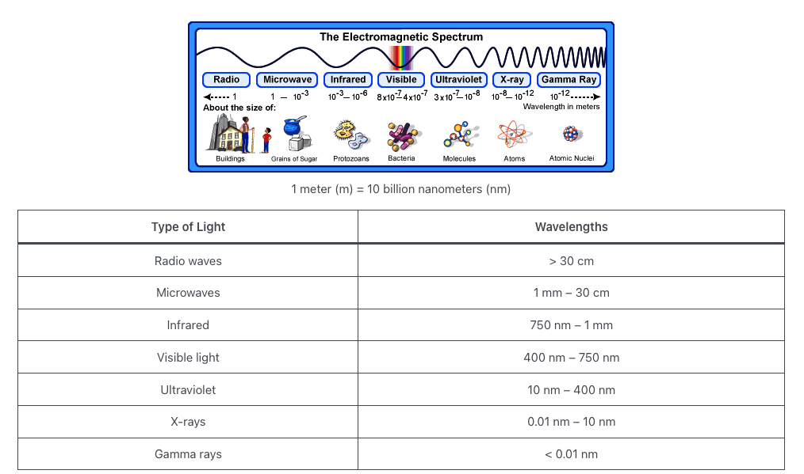
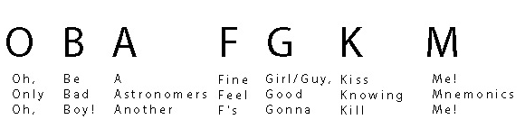

## Sloan Digital Sky Survey & NMSU Educational Materials

1. Celestial Coordinates - Terms & Definitions

    [RA & Dec](https://dev.voyages.sdss.org/preflight/locating-objects/ra-dec/)

1. Light - Electromagnetic (EM) Radiation - Terms & Definitions

    
    
    [Wave Properties of Light](https://courses.ems.psu.edu/astro801/content/l3_p2.html)

1. Basic reference for Spectra - Terms & Definitions

    [Magnitudes](https://dev.voyages.sdss.org/preflight/light/magnitudes/)

    [Spectra ](https://dev.voyages.sdss.org/preflight/light/spectra/)

    [Redshift](https://dev.voyages.sdss.org/preflight/light/redshift/)

1. Use this reference for determining Spectral Types of your mystery star!

    

    [What causes Absorption Emission Lines?](abs_ems_lines.md)

    [Characteritic Absorption Emission Lines](abs_ems_lines.png)

    [Spectral Types Classification](https://dev.voyages.sdss.org/expeditions/expedition-to-the-milky-way/spectral-types/classifying-stars/)

## New Mexico State University Stellar Spectroscopy Intro (Excellent Videos - Highly recommend watching)
### Dr. Christopher Churchill

### [Introduction to Stellar Spectra](https://www.youtube.com/watch?v=PX3u5lJ5d5g)

