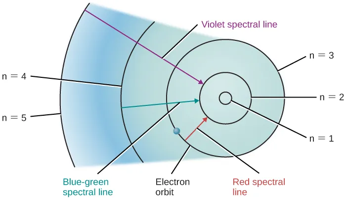
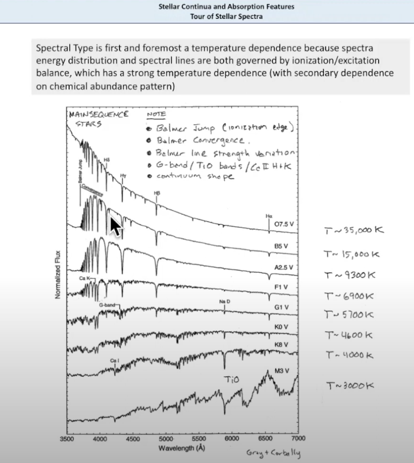
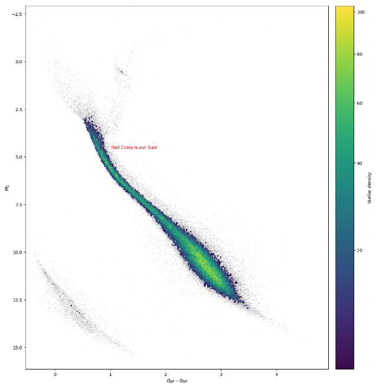

 

## [Tour of Stellar Spectra](https://www.youtube.com/watch?v=PX3u5lJ5d5g)
1. Most Important in all of Astrophysics
1. Spectroscopy is a ***Keystone*** of Astronomy
1. ***HUGE Dynamic Range of Stellar Luminosities (Flux)***
1. [look at this example jupyter notebook that shows dynamic range of flux comparisons](../notebooks/flux_comparisons.html)
1. ***MEDIUM range of Stellar Radii***
1. ***SMALLER range of Stellar Masses***
1. ***TINY range of Stellar Temperatures***
1. Luminosity Classes - Stellar Radii - Isochrones
1. [HRD explorer](https://astro.unl.edu/naap/hr/animations/hrExplorer.html) Show effect of varying star mass, luminosity, temperature and star radius
1. Stellar Evolution
1. 

1. What is regulating the surface temperature of a star? Gas pressure in the stellar atmosphere a.k.a Surface gravity, Density
1. Somewhat similar to the water kettle in your kitchen!
1. Why is the surface temperature of a star orders of magnitude cooler than the core temperature?

## What can you get out of Star brightness (Photometry)?
1. Apparent magnitude $m$
1. [Calculate Absolute from Apparent Magnitude](https://boyceastrows.gleeze.com/hub/user-redirect/git-pull?repo=https://github.com/drunarayan/barospection&branch=gh-pages&urlpath=lab/tree/barospection/references/soln_star_plx_lum_mag_v2.ipynb)
1. Absolute Magnitude $M$

## What can you get out of Spectra (Spectroscopy)?
1. Stellar Type & Temperature & Color Index (B-V)
1. Stellar Mass - Isochrones
1. Stellar Radius - Isochrones
1. Chemical Composition - absorption/emission features
1. Stellar Rotation - Thickness of lines
1. Stellar velocities - Doppler Blue/Red shifts in stellar lines
1. Hubble Constant Cosmological Expansion - Doppler Red shifts in Galaxies bright extra galactic objects Quasars, AGN, WR stars

## More Excellent Reference Materials
1. [Sloan Digital Sky Survey & New Mexico State University](SDSS_NMSU.md)

## The Ultimate yellow brick road !!

