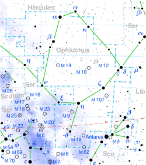

### Dave Dobrotka
#### [on team with Rishwanth](../Rishwanth)
Hello - I obtained a BS in astrophysics (a long time ago!) but ended up working in cyber security. 

### Assigned Star Rasalhague
My star is Rasalhague (Alpha Ophiuchi - https://en.wikipedia.org/wiki/Alpha_Ophiuchi).  It is an A5IVnn type star 48 light years away - a bluish-white subgiant that has evolved away from the main sequence after consuming the hydrogen at its core.  It is about twice the mass of the sun, radiating about 25 times the luminosity, and has an effective temperature of about 8,000 K.  Rasalhague is significantly oblate (it bulges!) due to an extreme rotational velocity (240 km/s - compared to the Sun at 2 km/s).  This makes the equator cooler and dimmer, a phenomenon called "gravity darkening."  I'm interested to see how this high rotational speed affects the spectra we collect.  Additionally (https://arxiv.org/abs/astro-ph/0703089):  "the spectrum of Alpha Ophiuchi shows an anomalously high level of absorption of the lines for singly-ionized calcium (Ca II). However, this is likely the result of interstellar matter between the Earth and the star, rather than a property of the star or circumstellar dust."  I'm not sure these absorption lines will be strong enough (or wide enough) to observe with our set up.  Rasalhague also has a 0.85 solar mass K-type, main sequence, companion star.  For double star enthusiasts (Richard!), the companion orbit is highly eccentric (0.92), with an orbital period of 8.6 years, and viewed nearly edge on from Earth.   A recent reference:  https://arxiv.org/abs/2107.02844

