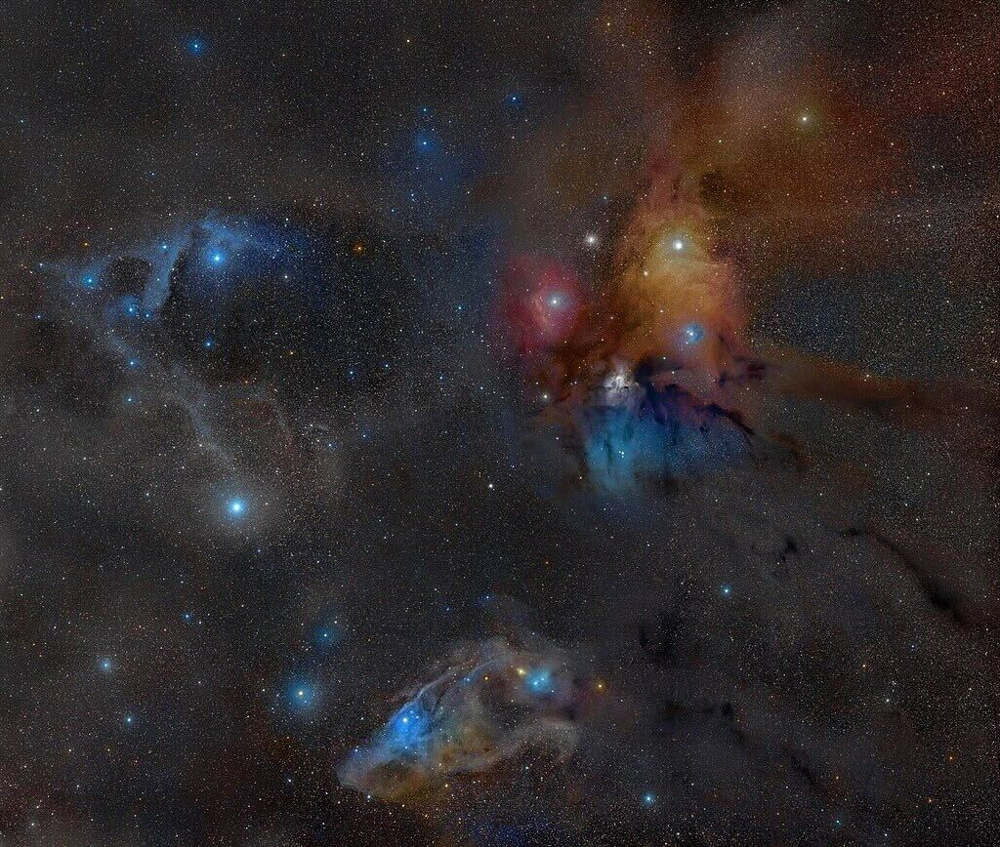

### Jae Calanog
#### [on team with no one so far]()
Hi everyone! I’m Jae. I’m a physics / astronomy professor at San Diego Miramar College and also serve as the department chair of Physical Sciences. 

### Assigned Star Dschubba
My assigned star is Dschubba, which is the primary star of a binary system with a highly elliptical orbit of about 10 years. Dschubba is a B class sub giant, which means it’s a bluish white massive star that’s in its latter stages of its evolution and fusing heavier elements in its core. Its current apparent magnitude is 2.32. Its companion is also a B class star but appears to still be on the  main sequence. Having a shorter period and both stars categorized as high mass stars, I wonder if at some point they’ll experience some stellar cannibalism. On the image below shows the rho Opiuchi region where Dschubba is in the sky, with Dschubba being the bright white star on the left.

