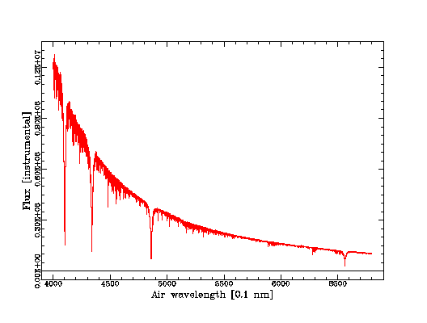

### Richard
#### [on team with Geoff](../Geoff/)
Hi Everyone, I am a retired Pathologist and lifetime amateur astronomer. I have a particular interest in double stars. I am also a keen astrophotographer. Alioth is my star  and it has some unusual spectroscopic features that I hope understand during this course. I also enjoy seeing the stars of the northern hemisphere when I travel.

### Assigned Star Alioth
From Wikipedia: Alioth spectral type A1III-IVp kB9.
Alioth spectral type is A1p; the "p" stands for peculiar, as its spectrum is characteristic of an α2 Canum Venaticorum variable. Epsilon Ursae Majoris, as a representative of this type, may harbor two interacting processes: first, the star's strong magnetic field separating different elements in its hydrogen 'fuel'; second, a rotation axis at an angle to the magnetic axis may be spinning different bands of magnetically sorted elements into the line of sight between Epsilon Ursae Majoris and the Earth. The intervening elements react differently at different frequencies of light as they whip in and out of view, causing Epsilon Ursae Majoris to have very strange spectral lines that fluctuate over a period of 5.1 days. The kB9 suffix to the spectral type indicates that the calcium K line is present and representative of a B9 spectral type even though the rest of the spectrum indicates A1.

Here is a spectrum of Alioth (Epsilon Ursae Majoris) from the BAA.
I also have a detailed reference
Title: The spectrum of the CR star Epsilon Ursae Majoris
Authors: Tektunali, H. G.
Journal: Astrophysics and Space Science, vol. 77, no. 1, June 1981, p. 41-58.
Bibliographic Code: 1981Ap&SS..77...41T
Also some high resolution professional spectra for eps Uma are present in the ELODIE archive (see attached sample image)
http://atlas.obs-hp.fr/elodie/fE.cgi?ob=objname,dataset,imanum&c=o&o=HD112185

